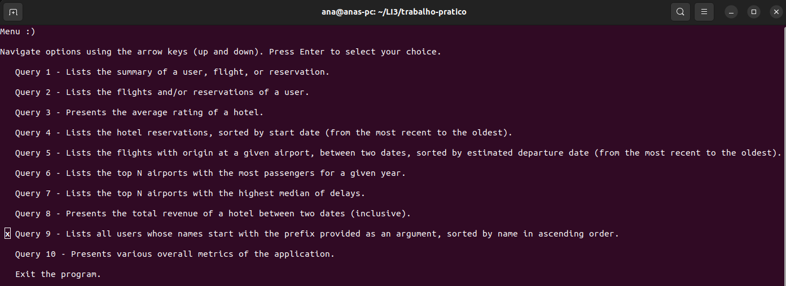
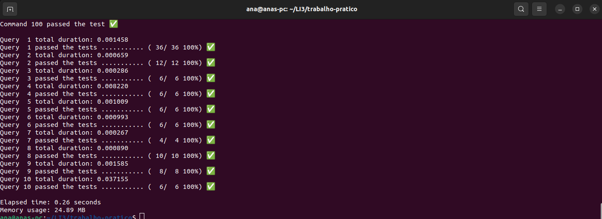
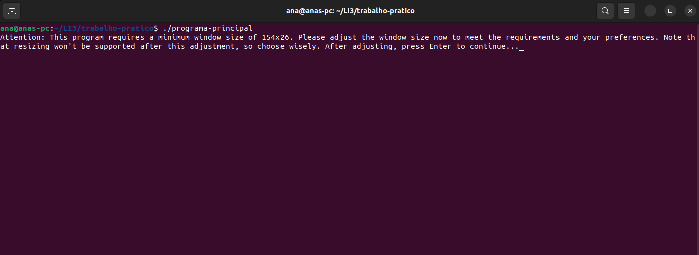
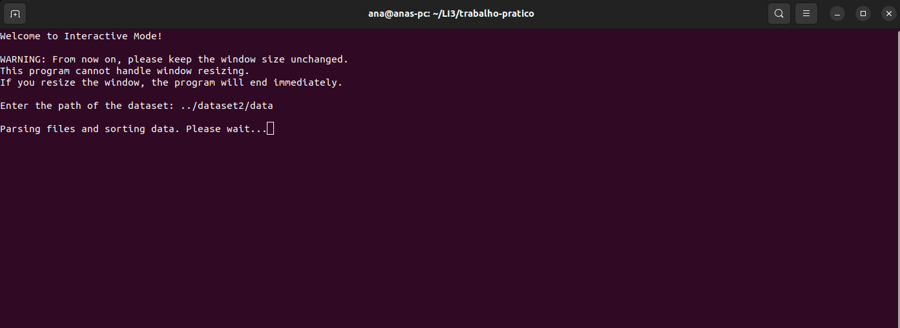
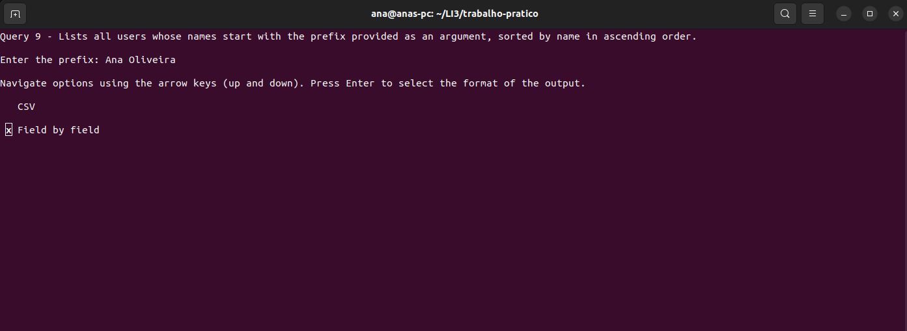
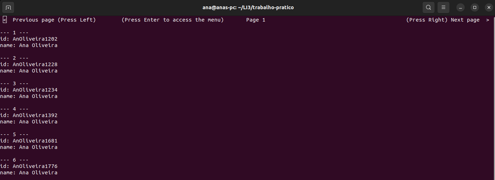
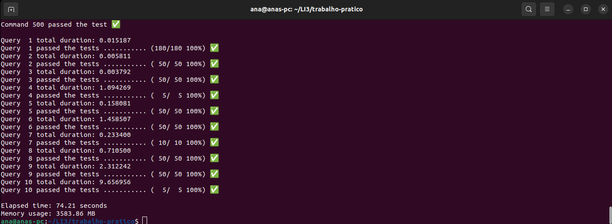

# Aplicação de Voos e Reservas ✈️🏨

## Projeto de LI3

Aplicação desenvolvida em C por nós no âmbito da Unidade Curricular de **Laboratórios de Informática III** (**LI3**) no ano letivo de 2023/2024. Esta aplicação permite consultar e analisar dados de **voos**, **reservas de hotéis** e **clientes**, a partir dos **datasets** fornecidos.



### Nota final: 19/20 ✅
- Fase 1: **18.1/20** ✅
- Fase 2: **19.5/20** ✅

## Como utilizar?

### Requisitos:

- Sistema operativo: Linux
- GNU Make instalado
- GCC (GNU Compiler Collection) instalado
- Biblioteca ncurses instalada

### Comandos:
```
git clone git@github.com:a104437ana/LI3.git
```
```
cd LI3
```
```
cd trabalho-pratico
```
```
make
```

> [!IMPORTANT]
> Maximizar o terminal para uma melhor experiência!

> [!IMPORTANT]
> Lê com atenção e segue as instruções dadas pelo programa!

#### Programa principal 📊
##### Modo interativo 💻
```
./programa-principal
```
Quando pedir o caminho para o dataset colocar isto:
```
../dataset1/data
```
Por fim, use as queries para consultar e analisar os dados deste dataset.
##### Modo batch 👨‍💻
```
./programa-principal ../dataset1/data ../dataset1/input.txt
```

Os resultados das queries do [dataset1/input.txt](dataset1/input.txt) estarão na pasta [trabalho-pratico/Resultados](trabalho-pratico/Resultados).
#### Programa testes ✅
```
./programa-testes ../dataset1/data ../dataset1/input.txt ../dataset1/outputs
```
### Objetivo

O objetivo deste trabalho foi desenvolver um programa capaz de gerir e consultar dados relacionados a utilizadores, voos e reservas, assegurando a correção funcional, eficiência na execução e boas práticas de modularidade e encapsulamento.

Para isso, desenvolvemos dois programas:
- O **programa principal**, responsável pela lógica central do sistema. Este módulo lê os ficheiros CSV fornecidos (`users.csv`, `flights.csv`, `passengers.csv` e `reservations.csv`), valida e armazena a informação em estruturas adequadas, descarta entradas inválidas (registando-as em ficheiros de erros) e executa as queries pedidas. O programa pode ser executado em dois modos:

  - **Modo batch**: usado para a execução automática de um conjunto de queries. Neste modo, o programa recebe como argumentos o caminho para o dataset e um ficheiro de comandos. Cada linha do ficheiro corresponde a uma query, que é interpretada e processada sobre os dados. O resultado de cada query é escrito num ficheiro próprio, seguindo o formato `commandX_output.txt`, armazenado na pasta `Resultados`. Se uma query contiver a flag F, o output assume um formato detalhado, campo a campo. Caso a query não devolva resultados, o ficheiro correspondente é criado mas fica vazio. Paralelamente, todas as entradas inválidas identificadas nos CSVs são registadas em ficheiros separados (`users_errors.csv`, `flights_errors.csv`, `reservations_errors.csv`, …), também guardados na pasta `Resultados`.

  - **Modo interativo**: permite ao utilizador executar queries diretamente através de um menu de interação no terminal. Neste modo, o utilizador fornece o caminho para o dataset e pode explorar os dados consulta a consulta, com paginação para facilitar a leitura de resultados extensos.
- O **programa de testes**, uma ferramenta separada que automatiza a verificação do funcionamento do programa principal, executando as queries de teste, comparando os resultados obtidos com os resultados esperados e avaliando o desempenho em termos de tempo e uso de memória.

Enquanto o programa principal realiza o processamento real dos dados, o programa de testes garante que ele esteja correto e eficiente.

## Projeto desenvolvido
### Aplicação e Testes
| Programa principal 📊                   | Programa testes ✅                  |
|:-----------------------------:|:------------------------------:|
|      |      |

### Organização do projeto
```
📁 LI3
├── 📁 dataset1                 # Dataset 1
├── 📁 readme                   # Imagens utilizadas neste README.md
├── 📁 trabalho-pratico         # Código e Documentação
│   ├── 📁 include              # Código
│   ├── 📁 Relatorio            # Imagens usadas nos relatórios
│   ├── 📁 Resultados           # Resultados das queries
│   ├── 📁 src                  # Código
│   ├── 📄 Makefile             # Makefile
│   ├── 📄 relatorio-fase1.pdf  # Relatório da fase 1 do projeto
│   └── 📄 relatorio-fase2.pdf  # Relatório da fase 2 do projeto
├── 📄 .gitignore               # Ficheiros e pastas a serem ignorados pelo Git
├── 📄 enunciado_li3_2324.pdf   # Enunciado do projeto
└── 📄 README.md                # Documentação principal do projeto
```
O enunciado deste projeto é o ficheiro [enunciado_li3_2324.pdf](enunciado_li3_2324.pdf).

O código e relatórios do projeto encontram-se na pasta [trabalho-pratico](trabalho-pratico).

O relatório da fase 1 deste projeto é o ficheiro [trabalho-pratico/relatorio-fase1.pdf](trabalho-pratico/relatorio-fase1.pdf).

O relatório da fase 2 deste projeto é o ficheiro [trabalho-pratico/relatorio-fase2.pdf](trabalho-pratico/relatorio-fase2.pdf).

Na pasta [dataset1](dataset1) temos o dataset 1, o dataset menor usado no projeto.

> [!NOTE]
> O dataset 2, o dataset maior usado no projeto, não se encontra disponível neste repositório por ser muito grande ☹️

Na pasta [trabalho-pratico/Resultados](trabalho-pratico/Resultados) temos os resultados das queries realizadas e as entradas inválidas dos ficheiros CSV.

### Exemplo do Programa principal no Modo Interativo (dataset 2)






> [!TIP]
> No dataset 1 não existe nenhuma Ana Oliveira, mas existe pessoas chamadas Ana. Podes fazer a query 9 com o nome Ana apenas para já teres resultados com o dataset 1.

### Exemplo de Testes (dataset 2)


## Autores
### Grupo 4
- a104437 - Ana Sá Oliveira - [a104437ana](https://github.com/a104437ana)

- a104263 - Inês Silva Marques - a104263 

- a76350 - José Rafael De Oliveira Vilas Boas - rafael-vilasboas